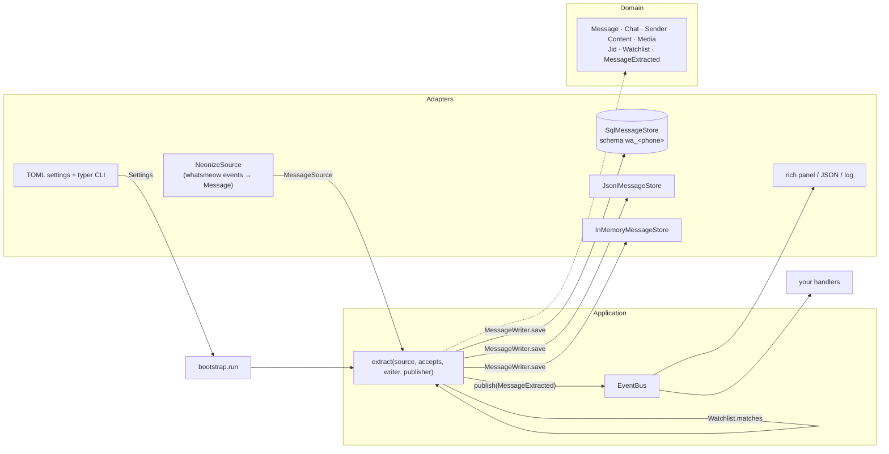
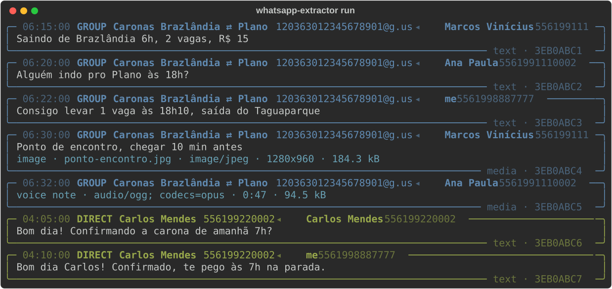
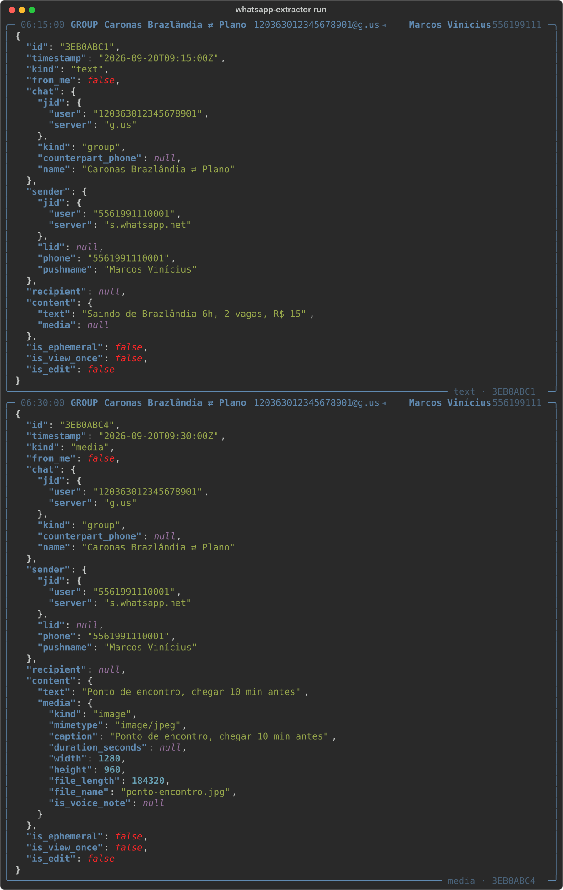
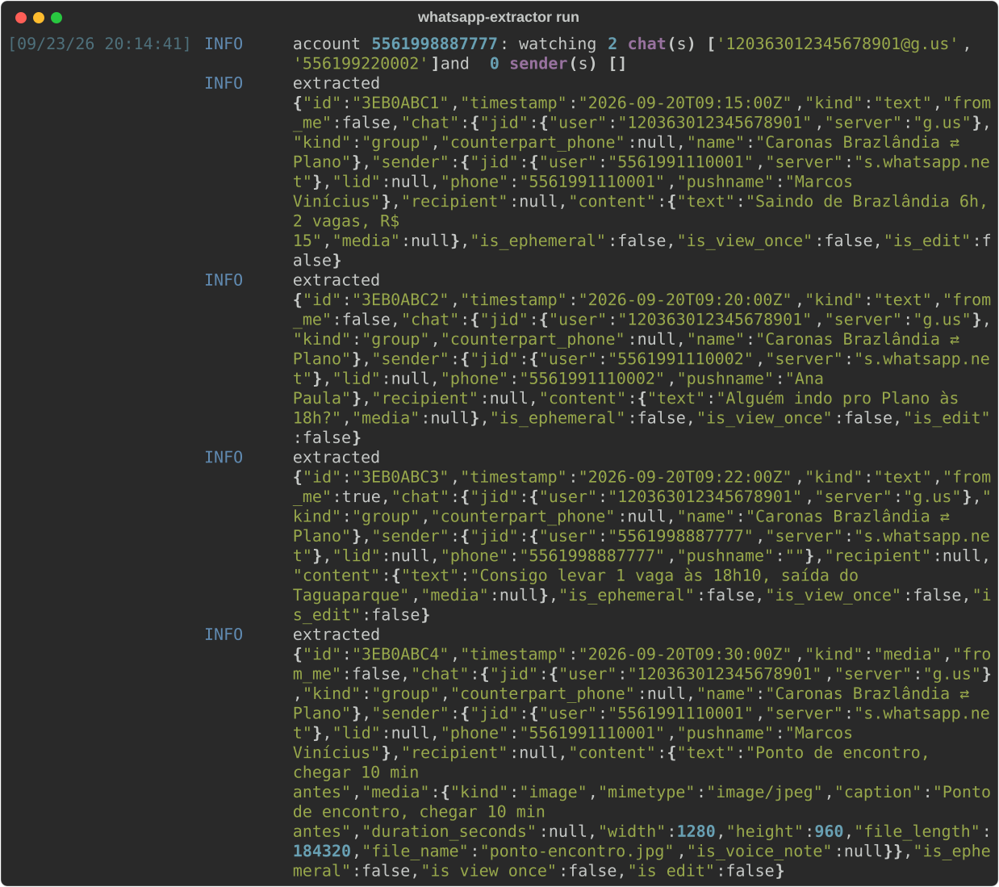

# whatsapp-extractor

[](https://github.com/edududs/whatsapp-extractor/actions/workflows/ci.yml)
[](https://github.com/edududs/whatsapp-extractor/releases)
[](pyproject.toml)
[](https://github.com/astral-sh/ruff)
[](pyproject.toml)
[](LICENSE)

Turn a WhatsApp account into a stream of typed, persisted messages that other programs can react
to. One paired phone, a watchlist of chats or senders, and every accepted message is saved, then
announced on an in-process event bus.

    WhatsApp ──neonize──▶ MessageSource ──▶ Watchlist ──▶ MessageWriter ──▶ EventBus ──▶ handlers

## The problem

Groups on WhatsApp carry information that never reaches a database: ride offers, price lists,
community notices, announcements. Reading them by hand does not scale, and each project that tried
to automate it rebuilt the same plumbing: connect a device, decrypt events, dedupe, decide what to
keep, store it, and only then get to the interesting part.

This package is that plumbing, done once, as a piece other projects embed. The interesting part
stays in the embedding project: a classifier, a webhook, a Django model, a dashboard.

## What it is, and is not

**It is**

- A library with a hexagonal core: a WhatsApp domain model, four ports and one use case,
  `extract`, with pydantic as the only dependency of the core.
- A set of bundled adapters: neonize as the source, SQL (PostgreSQL or SQLite), JSON Lines and
  memory as stores, rich views for the terminal, TOML configuration and a typer CLI.
- A test kit other adapters can run against: Hypothesis strategies and a store contract.
- Multi-account by design. Each paired phone keeps its own message schema; one process serves one
  account.

**It is not**

- A bot. It reads; it never sends.
- A media downloader. Media arrives as metadata.
- An official integration. It uses [neonize](https://github.com/krspy/neonize), a binding of
  Go's whatsmeow, which is an unofficial client. This project is not affiliated with Meta or
  WhatsApp, and using it may breach WhatsApp's terms of service.

## Architecture



- **Domain**: frozen pydantic models. `Message` is the aggregate; `Jid`, `Chat`, `Sender`,
  `Content`, `Media` and `Watchlist` are value objects; `MessageExtracted` is the domain event.
- **Application**: the ports (`MessageSource`, `MessageFilter`, `MessageWriter`, `MessageStore`,
  `EventPublisher`, `EventHandler`), the `extract` use case and an ordered in-process `EventBus`.
- **Adapters**: everything that touches a library. neonize, SQLAlchemy and Alembic, rich, tomlkit,
  typer. Each is replaceable through its port.
- **Composition root**: `bootstrap.py` is the only module that knows every concrete piece; the CLI
  is a thin typer layer over it.

`extract` saves before it publishes. A store error stops the run; a handler error is logged and
isolated. The rule that `domain` and `application` import nothing but the standard library,
pydantic and each other is a test, not a convention: `tests/test_architecture.py` fails the build
when it is broken.

The reasons behind these choices, and what was tried and dropped, are in
[docs/decisions.md](docs/decisions.md).

## What it looks like

Three views of the same stream. Panel and JSON need the `rich` extra; `log` is plain logging.

**`view = "panel"`**



**`view = "json"`**



**`view = "log"`**



## Quick start

Python 3.13 or later. The package is installed from Git:

```sh
uv add "whatsapp-extractor[rich] @ git+https://github.com/edududs/whatsapp-extractor@v0.2.1"
```

Extras: `rich` (terminal views), `postgres` (asyncpg driver), `testing` (Hypothesis strategies
and the store contract).

From a checkout, pair a phone, pick what to watch, run:

```sh
uv sync --all-extras
cp .env.example .env                 # PowerShell: Copy-Item .env.example .env
uv run whatsapp-extractor pair       # scan the QR code from WhatsApp › Linked devices
uv run whatsapp-extractor account use 5511900000001
uv run whatsapp-extractor groups     # lists address, name and size of every group
uv run whatsapp-extractor watch add 120363000000000001@g.us
uv run whatsapp-extractor run
```

Messages land in `wa_<phone>.db` next to the session file, or in the PostgreSQL database named by
`EXTRACTOR_DATABASE`. Point `EXTRACTOR_MESSAGES_DATABASE` elsewhere to keep messages apart from the
WhatsApp credentials. The full configuration, every command and every environment setting are in
[docs/reference.md](docs/reference.md).

## Embedding it

`bootstrap.run` composes the bundled pieces and accepts yours. A handler reacts to each stored
message; a writer replaces the persistence:

```python
import asyncio
from pathlib import Path

from whatsapp_extractor import Message, MessageExtracted
from whatsapp_extractor.bootstrap import run
from whatsapp_extractor.settings import Settings


class MyWriter:
    """Any object with `save`: a Django model, an HTTP client, a queue producer."""

    async def save(self, message: Message) -> None: ...


async def notify(event: MessageExtracted) -> None:
    print(event.message.chat.jid.value, event.message.content.text)


settings = Settings.load(Path("extractor.toml"), account="5511900000001")
asyncio.run(run(settings, notify, writer=MyWriter()))
```

- **Persistence** goes through `MessageWriter` (`save`). `MessageStore` adds `load` for adapters
  that can read back, and `MessageStoreContract` from `whatsapp_extractor.testing` proves an
  adapter honors the port.
- **Reactions** go on the bus as handlers of `MessageExtracted`. They run in order, after the save,
  on the same event loop.
- **Several policies for one account**: run once with the union of the chats they need, then let
  each consumer query the `messages` table by `chat_jid` with its own cursor, or filter inside its
  handler. WhatsApp allows one connection per device, so one process per phone is a hard limit.

## Known limits

- **One process per account.** A second connection for the same phone disconnects the first.
- **The Go runtime is in the process.** neonize embeds whatsmeow; a panic in Go ends the Python
  process. Run it under a supervisor.
- **Bounded buffer.** When the buffer is full, new messages are dropped and logged. Size it with
  `buffer_size`.
- **Session tables are whatsmeow's.** They live in `public` and outside any migration you own.
- **Unofficial client.** Account bans are a possibility WhatsApp reserves; use a number you can
  afford to lose.

## How it is built

- `uv` for environments, `ruff` with every rule enabled and each exception documented, `pyright`
  in strict mode, `pytest` with Hypothesis and a coverage floor. `uv run poe fix` runs the whole
  gate; CI runs it on Ubuntu and Windows, on Python 3.13 and 3.14.
- Conventional Commits generate the [changelog](CHANGELOG.md) and the release notes through
  git-cliff; a pushed tag becomes a GitHub Release. Versions follow SemVer; before 1.0 the public
  contract may still move on a minor version.
- The architecture is specified first, then implemented. Implementation work is delegated to AI
  coding agents that operate under written specifications and the decisions recorded in
  [docs/decisions.md](docs/decisions.md); the automated gate is the arbiter for what they produce,
  and every change is reviewed before it lands. Documentation is written for a human reader.

See [CONTRIBUTING.md](CONTRIBUTING.md) for the workflow and
[docs/runbooks/release.md](docs/runbooks/release.md) for releases.

## License

[MIT](LICENSE).
